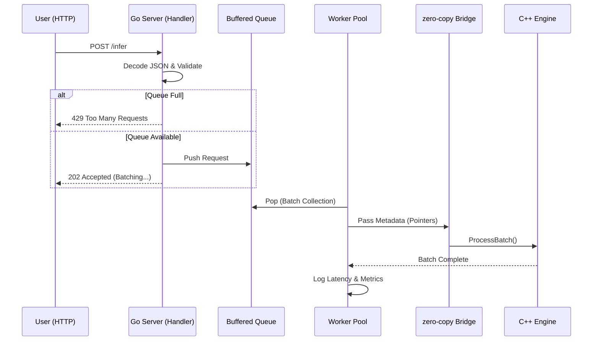

# InferX: Architectural Summary 🏛️

InferX is a production-grade inference server that combines **Go's high-concurrency primitives** with **C++'s raw compute performance**. This document outlines the core subsystems and the lifecycle of a request.

## 🔄 Request Lifecycle

## 🛠 Core Components

### 1. The API Layer (Go)
- **Non-Blocking Handlers:** Uses `select` statements to trigger backpressure (Load Shedding) when the internal queue is full. This protects the server's memory and maintains stable p99 latency.
- **Worker Pool:** A pool of background goroutines that manage batch orchestration and Cgo interaction.

### 2. Dynamic Batching (Go)
- **Adaptive Flushing:** Workers wait for a full batch (`BATCH_SIZE`) or a timeout (`BATCH_TIMEOUT_MS`) before calling the engine. This maximizes throughput during high load while minimizing latency during low load.

### 3. The Zero-Copy Bridge (Cgo)
- **Shared Memory:** Uses `unsafe.SliceData` to pass raw memory addresses of request metadata directly to C++. 
- **Efficiency:** This eliminates the need for expensive data copying across the language boundary (Go ↔ C++).

### 4. The Inference Core (C++)
- **Metadata-Aware Compute:** The C++ core receives an array of prompt lengths and performs realistic CPU-intensive simulations proportional to the metadata.
- **Buffer-Efficient I/O:** Uses optimized console output (`\n` vs. `std::endl`) to minimize logging overhead at scale.

## 📊 Observability
- **Atomic Counters:** Uses `sync/atomic` for lock-free tracking of accepted, rejected, and processed requests.
- **Prometheus Standard:** Exposes a standard `/metrics` endpoint for integration with modern monitoring stacks (Grafana, etc.).
- **Built-in Profiling:** Integrated `pprof` for deep-dive performance auditing.
